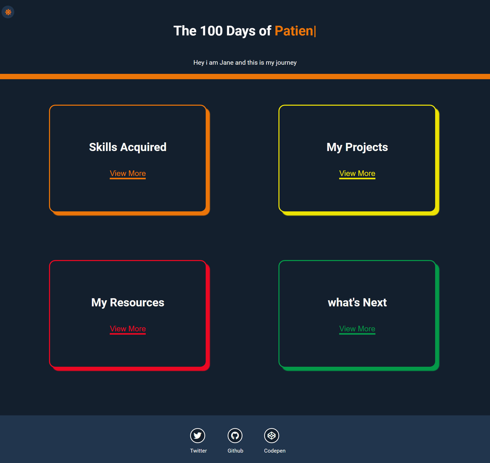

# 100 days of code website
## Live Code - [Preview](https://muchirijane.github.io/100-days-website/)
<!-- ctrl+shift+v : preview -->


> This is a website built after completing 100 days of code challenge

---

### Table of Contents
You're sections headers will be used to reference location of destination.

- [Description](#description)
- [How To Use](#how-to-use)
- [Author Info](#author-info)

---

## Live Code - [Preview](https://muchirijane.github.io/100-days-website/)

## Description

This is a 100days of code portfolio that i have created after finishing the 100days challenge. 
I have highlighted different section from the skills, projects, resources and what i will do next.
Before the challenge i didn't think you can actually make websites without a cs degree or bootcamp.
But i did it and i have learnt so much. The projects are done with vanilla JavaScript no frameworks.

#### Technologies

- HTML
- CSS
- SASS
- JAVASCRIPT

[Back To The Top](#100-days-of-code-website)

---

## How To Use
```html
    <p>Use a command Prompt and type : npm start</p>
```

#### Installation
```html
    <p>Use a command Prompt and type : npm install</p>
```
 
## Author Info

- Twitter - [@TracyCss](https://twitter.com/TracyCss)
- Website - [Ui portfolio projects](https://janemuchiri.com)

[Back To The Top](#100-days-of-code-website)
